# dm-start

The dm-start project provides the template of a dark-matter Domain Specific Language (DSL) project.

The dark-matter mechanisms allow you to focus on the conceptual model of the domain you're dealing
with and provides a modular persistence/specification approach that minimizes the coding involved.
All of the infrastructure required to parse, load and organize your configuration objects for use
in your application is generated for you based on a schema specification.

By running the [bootstrap](#2-2-run-dsl-bootstrap) utility and providing a java package and name for the DSL, you'll get the following:

- an example schema specification
- the code generated from that schema
- a module (configuration file) that contains examples of the DSL concepts
- a module loader class that parses/loads your DSL modules
- a definition manager that provides a single point of access for all loaded configuration
- an example utility that allows you to load one or more modules
- A JUnit test that executes the DSL utility
- the Maven pom required to create a shaded (self-contained), executable jar of the DSL

# 1 Environment Setup

## 1.1 Requirements

- JDK 1.8
- Eclipse at [2020-12-R (4.18)](https://www.eclipse.org/downloads/packages/release/2020-12/r) or earlier (the Eclipse IDE for Enterprise Java Developers version is a good choice)

## 1.2 Preference tweaks

Once Eclipse is installed, it's recommended that you make the following changes to your preferences:

- Version Control (Team) -> Git - Set: Default repository folder to: **${workspace_loc}**
- Maven -> Errors/Warnings - Set: Plugin execution not covered by lifecyle configuration to: **Ignore**
- Java -> Installed JREs -> Ensure that your 1.8 JDK is selected
- Java -> Compiler - Set: Compiler compliance level to: 1.8

If you have many JREs installed, you may also have to alter:
- Java -> Installed JREs -> Execution Environment  Select the appropriate JRE you want to use for execution


NOTE: When executing the Maven build for your DSL within Eclipse, you may see [warnings](); you may safely ignore them.


# 2 Create your DSL

## 2.1 Clone the dm-start project

- Select File -> Import
- Select Git -> Projects from Git and hit Next
- Select Clone URI and hit Next
- Enter the URI: `https://github.com/dark-matter-org/dm-start.git` and hit Next
- The `master` branch should be selected - hit Next
- You'll be importing into your Eclipse workspace - hit Next
- Import existing Eclipse projects should be selected - hit Next
- Hit finish

## 2.2 Run DSL Bootstrap

In the Eclipse menu bar, select the small black triangle next to the green "Run Configuration" icon and select "DSL Bootstrap":

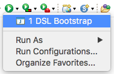

You will be prompted to enter a new Java package name - in this case, `com.example.xdsl` and an 
abbreviation/file extension for your DSL, in this case, `xdsl`

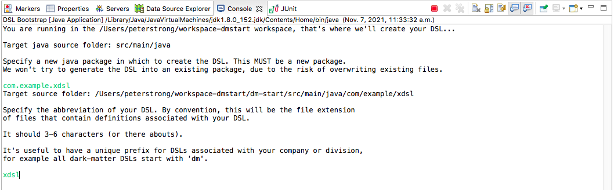

After hitting enter after your abbreviation, you'll see feedback on the files being generated:

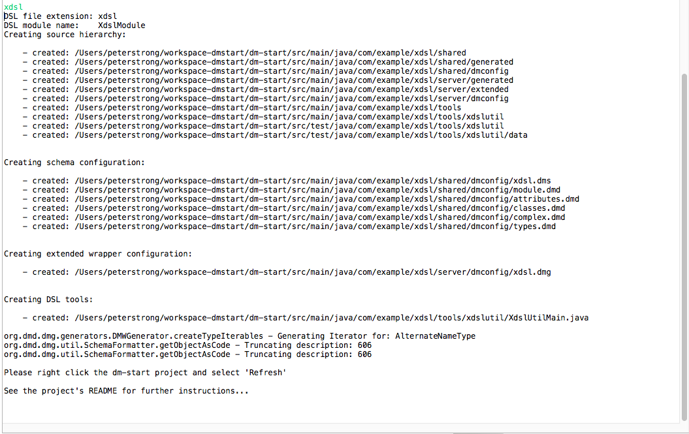

Once the DSL has been generated, right click the dm-start project and select "Refresh":

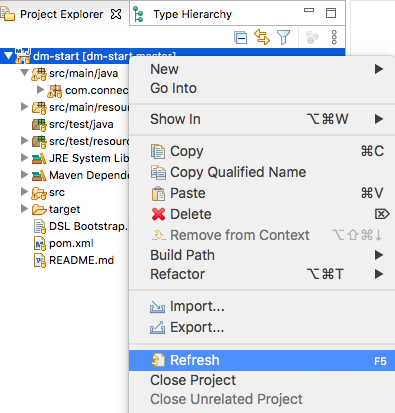

## 2.3 Run Maven Install

Right click the project and select "Run As -> Maven install" - this will create a shaded, executable jar of your DSL project:

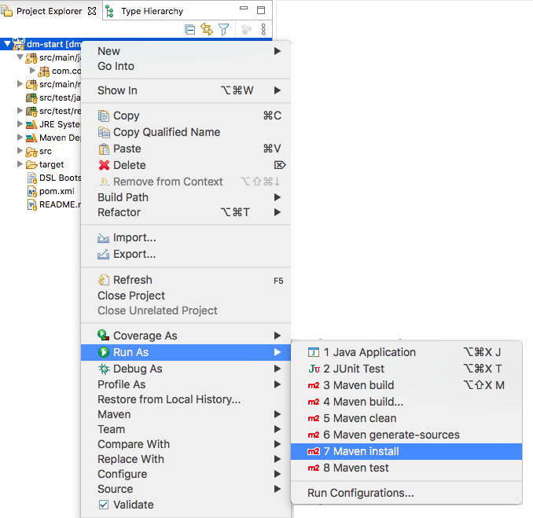

** Note: ** If the build fails and indicates that no compiler is available, ensure that you have completed the preference tweaks for the Java installed JREs and Compiler. Then, right click the dm-start project and select Maven -> Update Project... (and hit OK)

As a result of this, you will see that various artifacts are created in your local Maven repository.
In the case of this example you'll see the following artifacts in `~/.m2/repository/com/example/xdsl/xdsl/0.0.1-SNAPSHOT`:
* `xdsl-0.0.1-SNAPSHOT.jar`
* `xdsl-0.0.1-SNAPSHOT.pom`
* `xdsl-0.0.1-SNAPSHOT-shaded.jar`

Of these, the most important is the `shaded` JAR - this is an executable JAR that can be provided to users of your DSL.

If you create an alias like: <br>
`alias xdsl='java -jar ~/.m2/repository/com/example/xdsl/xdsl/0.0.1-SNAPSHOT/xdsl-0.0.1-SNAPSHOT-shaded.jar'`

And then run `xdsl` you'll see the help associated with the generated utility that exists in `com.example.xdsl.tools.xdslutil.XdslUtilMain`

## 2.4 Run JUnit for XdslutilMain

In you project explorer, navigate to:

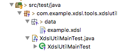

Right click `XdslUtilMainTest` and select Run As -> JUnit Test

You'll see the following output:

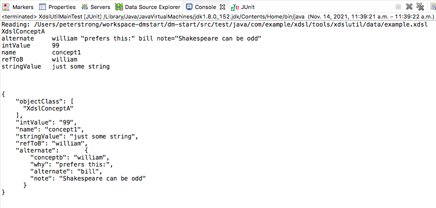

Running the test has read the contents of `data/example.xdsl` that contained:

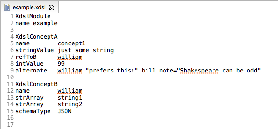

## 2.5 Generated code structure

The bootstrap process will result in the following set of code and configuration generated beneath the
`com.example.xdsl` package in `src/main/java` and `src/test/java`:

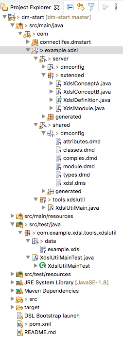

You will notice several `generated` directories in this hierarchy. These are generated by the dark-matter
code generation mechanisms and are not intended to be checked in to your resulting project. Attendent `.gitignore`
files have been set to ignore the `generated` directories.

The following sections indicate some of the more important directories and what you'll find in them.

NOTE: the `shared` and `server` nomenclature for the two primary directories results from dark-matter's
original development to support the creation of  
[Google Web Toolkit](http://www.gwtproject.org/)
projects. Another tutorial will be created to demonstrate these capabilities.


### 2.5.1 The dark-matter schema directory

The `com.example.xdsl.shared.dmconfig` directory contains the dark-matter schema specification that 
defines the concepts associated with your DSL.

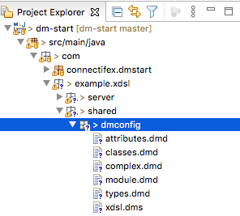

The content of these files is discussed in the [Dark Matter Schema](#3-3-dark-matter-schema) section.

# 3 Basic dark-matter concepts

The following sections describe some of the main concepts associated with dark-matter.

## 3.1 Dark Matter Objects (DMOs)

The Dark Matter Object (DMO) - pronounced dee-moh - forms the core of the dark-matter framework.
At base, it is a Plain Old Java object (POJO) that represents its values as a map of attribute values.
This approach allows for many capabilities that we won't discuss here, but, suffice to say, you
don't need to worry about getting/setting attributes values, the getters/and setters are generated
for you automatically.

## 3.2 Object Instance Format (OIF)

The persistence format for a DMO is Object Instance Format (OIF) - a very clean, text-based format
that is straightforward for humans to write and read. An example of this format is:

```
AttributeDefinition
name        stringVlaue
dmdID       10
type        String
description Holds a String
```

This is an `AttributeDefinition` object instance; the class of object is always the first line of
a DMO in OIF format; you never need to guess what you're looking at, a DMO is self-describing.

This is followed by one or more attribute values - you can think of these
as name-value pairs if you like.

If an attribute is multi-valued i.e an array or a set values, you simply repeat the name of the attribute.
The following shows multiple blocks of descriptive text.

```
AttributeDefinition
name        stringVlaue
dmdID       10
type        String
description Holds a String
description And, another block of description, since
 the description attribute is multi-valued. Attributes
 can span multiple lines.

```

This also demonstrates that starting a line with a whitespace character causes it to be
concatenated with the previous line.

One or more blank lines must separate object instances. For example, here are two `AttributeDefinition` instances.

```
AttributeDefinition
name        attr1
dmdID       20
type        String
description An attribute

AttributeDefinition
name        attr2
dmdID       22
type        String
description Another attribute.

```

OIF uses Java style `//` commenting to allow for additional comments or commenting out sections
of your OIF-based configurations:

```
AttributeDefinition
name        stringVlaue
dmdID       10
type        String
// The following line has been commented out
// description Holds a String
```

This is enough to get you started and you'll see OIF used everywhere.

## 3.3 Dark Matter Schema

All of the concepts of your DSL are described using dark-matter's meta schema. The meta schema
is defined in terms of itself and bootstrapped in the base [dark-matter-data](https://github.com/dark-matter-org/dark-matter-data)
project - we won't go in to those details here.

We will, however, cover the building blocks that let you define the concepts associated with
your DSL:

- [Types](#3-3-1-types)
- [Attributes](#3-3-2-attributes)
- [Classes](#3-3-3-classes)

If you've followed the example, your dark-matter schema files will be here:


If you're interested, you can look at [metaSchema.dms](https://github.com/dark-matter-org/dark-matter-data/blob/master/src/org/dmd/dms/meta/metaSchema.dms) for all the gory details ;-)


### 3.3.1 Types

The dark-matter framework provides an extensible typing system. We won't discuss the extension mechanisms
here, but will cover the primitive built-in types, enumerations and complex types in the following sections.

Also, when you create [Classes](#3-3-3-classes), types are automatically created for them so that they can
be referred to when creating [reference attributes](#3-3-2-1-reference-attributes); more on that later.

The `TypeDefinition` is part of dark-matter's meta schema and provides the basic building block of [Attributes](#3-3-2-attributes).

#### 3.3.1.1 Primitive Types

The primitive types provided by dark-matter are as follows:

- Boolean
- Byte
- Date
- Double
- Float
- Integer
- Long
- String

#### 3.3.1.2 Enumerations

Enumerations provide a mapping from String values to Integers and are often used to restrict 
a specification to a pre-defined set of values. 

The `types.dmd` file contains an example of an `EnumDefinition`:

```
EnumDefinition
name             SchemaTypeEnum
nullReturnValue  SchemaTypeEnum.JSON
enumValue        0 AVRO        The schemas is AVRO.
enumValue        1 JSON        The schemas is JSON.
enumValue        2 XML         The schema is XML.
description      An example of an Enum type.
```

By convention, the name of an `EnumDefinition` must end with `Enum`.

You may also specify a `nullReturnValue` so that if you are accessing an attribute of this type that doesn't have an explicit
value specified, you'll get the `nullReturnValue` as a default.

#### 3.3.1.3 Complex Types

The `ComplexTypeDefinition` allows you to specify a complex type composed of other types. It allows instances of the type to be
specified on a single line and basically defines a micro-grammar. The class generated from a `ComplexTypeDefinition` represents an immutable value that provides convenient constructors to handle a String value or all specified portions that make up the type, along with getters for each of the `parts`.

Have a look at `complex.dmd` for the following example:

```
ComplexTypeDefinition
name            AlternateNameType
requiredPart    XdslConceptB conceptb  "A reference to a XdslConceptB instance."
requiredPart    String       why       "Why you're giving it an alternate name." quoted=true
requiredPart    String       alternate "The alternate name of something."
optionalPart    String       note      "Some other note you want to add."        quoted=true
description     An example of a complex type. You can think of this as a micro grammar
 to define an attribute with many parts, both required and optional. The generated code
 takes care of sanity checking and gathering all of the parts for use.
 </p>
 The micro grammar is:
 <pre>
 conceptb "why" alternate [note]
 </pre>
 Where:
 <ul>
 <li>conceptb  - A reference to a XdslConceptB instance. </li>
 <li>why       - Why you're giving it an alternate name. </li>
 <li>alternate - The alternate name of something. </li>
 </ul>
 Optional:
 <ul>
 <li>optional  - Some other note you want to add. </li>
 </ul>
//
description  An example: william "prefers this:" bill note="Shakespeare can be odd."
```

This type is used in the `example.xdsl` file that's used to test parsing of the DSL. Here, the `alternate` attribute
is of type `AlternateNameType`:

```
XdslConceptA
name        concept1
stringValue just some string
refToB      william
intValue    99
alternate   william "prefers this:" bill note="Shakespeare can be odd"
```

By default, the separator for the parts is whitespace. However, in some cases, you might want to use a different `fieldSeparator`; you would do this by specifying:

```
ComplexTypeDefinition
name            AlternateNameType
fieldSeparator  |
.
.
.
```

Once you've regenerated your code, you would be able to specify:

```
XdslConceptA
name        concept1
stringValue just some string
refToB      william
intValue    99
alternate   william|"prefers this:"|bill|note="Shakespeare can be odd"
```

The are other parts to the part definitions that we'll cover at another point.

### 3.3.2 Attributes

The `AttributeDefinition` allows for the specification of attribute values of a particular type that can be composed
into [Classes](#3-3-3-classes).

Attributes (and Classes) currently have unique numeric identifiers - the `dmdID` - within a particular schema. These are used
when serializing/deserializing the attribute and as a hash value to access the attribute within a `DMO`. We won't go into
the details of this aspect here; just realize that you need to have unique values for `dmdID`.

You may wonder why attributes are given first class status and have their own definitions; most schema mechanisms simple bury 
attributes (or properties) in the class that uses them. The reasoning behind defining attributes this way comes from the fact that in 
many systems, the same attribute has the same semantics regardless of where it is used. With dark-matter, you can specify the 
attribute, its type and documentation once and then refer to it in all locations where you want to use it.

You can see examples of `AttributeDefinition` specifications in the `attributes.dmd` file.

Here's the specification of a single-valued attribute to hold a string:

```
AttributeDefinition
name           stringValue
dmdID          10
type           String
description    Holds a String
```

The `type` will be a reference to a [primitive](#3-3-1-1-primitive-types), [enumeration](#3-3-1-2-enumerations), [complex](#3-3-1-3-complex-types) or [class](#3-3-3-classes) type.

For collections of values, you specify a `valueType`. Here's an example of a MULTI-valued string attribute:

```
AttributeDefinition
name           strArray
dmdID          20
type           String
valueType      MULTI
description    Holds an multi-valued String
```

Various other `valueType` can be used, such as `TREESET`, `HASHSET` and `INDEXED`; these will be covered in another tutorial.

#### 3.3.2.1 Reference Attributes

One particularly powerful mechanism in dark-matter is the reference attribute.

A reference attribute is used to refer to another object instance by name and allows for sanity checking to ensure that
the object being referred to exists.

Here's an example of a reference attribute:

```
AttributeDefinition
name           refToB
dmdID          25
type           XdslConceptB
description    A reference to an instance of a XdslConceptB object. A reference
 attribute is one that refers to a "named" object class
```

In the sample data used for testing, you'll see `refToB` used:


On the surface, this appears very straightforward (which it is meant to be), but it allows for:

- reuse of common concepts so that parts of your DSL configuration don't need to be repeated (and, as a side-affect
of this, make a change in one referenced object and not have to make the change in many other places)
- object instances to "know" what other objects are referring to them (this will be covered in another tutorial)
- decomposition of monolithic "documents" (often used in JSON, XML and YAML approaches) into discrete chunks that are much easier 
to manage/maintain
- an easily navigable "graph" of the concepts that comprise your DSL

Being able to easily reference concepts/configuration by name is probably the single biggest mind set shift
introduced in dark-matter, but once you've made that shift, creating complex, external configuration for
an application becomes straightforward.


### 3.3.3 Classes

Finally, we reach the whole point of having types, complex types and attributes - defining classes via the `ClassDefinition`.

Here's an example:

```
ClassDefinition
name                        XdslConceptA
classType                   STRUCTURAL
dmdID                       5
useWrapperType              EXTENDED
derivedFrom                 XdslDefinition
isNamedBy                   name
must                        name
may                         stringValue
may                         intValue
may                         refToB
may                         alternate
may                         description
description                 This is an example concept - rename it to reflect a concept you wish to model.
```

Since we're working in Java, there's a direct correspondence between your `ClassDefinition` and a Java class.

The `name` of your class must be a valid Java class name.

The `classType` will generally be either:

- `ABSTRACT` to create a abstract class or
- `STRUCTURAL` to allow for classes that can be instantiated

Derivation is specified using `derivedFrom`. In this case, you'll see that `XdslConceptA` is `derivedFrom` the `XdslDefinition`; this is the 
[base definition](#3-3-3-1-the-base-dsl-definition) for our DSL; see that section for more details.

Although dark-matter allows for "unnamed" classes, you will always specify:

```
isNamedBy  name
must       name
```

as part of your `ClassDefinition`. Another tutorial will cover alternate naming mechanisms - just follow this convention
for now.

Another convention you should follow for now is specifying:

```
useWrapperType   EXTENDED
```

This allows you to extend your concepts with behavior via the [generation gap pattern](#3-3-3-2-the-generation-gap-pattern) which discussed in a following section.

When it comes to the attributes of your class, you specify:

- `must` to indicate that the attribute is mandatory and
- `may` to indicate that the attribute is optional

And, of course, it's always good to provide a `description` of what the intent of the concept is.


#### 3.3.3.1 The Base DSL Definition

Every dark-matter DSL will have a base DSL `ClassDefinition` i.e. the base class from which all concepts in the DSL are derived.

For our example the definition is:

```
ClassDefinition
name              XdslDefinition
classType         ABSTRACT
dmdID             2
useWrapperType    EXTENDED
derivedFrom       DSDefinition
isNamedBy         name
must              name
must              definedInXdslModule
description       This is class definition from which all concepts for the xdsl domain-specific language will be derived.
//
description       DO NOT ALTER THIS DEFINITION!!!
```

All concepts in your DSL MUST have the base definition as the root of the derivation hierarchy. You may introduce other 
sub-hierarchies of classes within your DSL - this is very handy in many situations, but the root class must 
always be the base definition.

#### 3.3.3.2 The Generation Gap Pattern

Defining the form of your configuration concepts is one thing, but defining the behavior associated with those
concepts is another. 

Different code generation mechanisms use different approaches to allow for addition of manually created code to
the mix. In the case of dark-matter, this is supported via the "generation gap pattern" i.e. in a class derivation
hierarchy, you will see generated code followed by manually written code down the hierarchy.

If you show the type hierarchy for the `XdslConceptA` class:

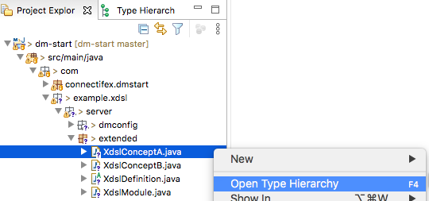
 
You will see the following class hierarchy:

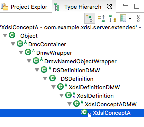

We won't cover the entire hierarchy now, but suffice to say that the classes that end with `DMW` are generated
 "dark-matter wrapper" (DMW) classes that have generated getters, setters and constructors for your classes, 
interleaved with classes that you can extended with behavior of your choosing.

#### 3.3.3.3 The Extended Classes

The extended classes can be found here:

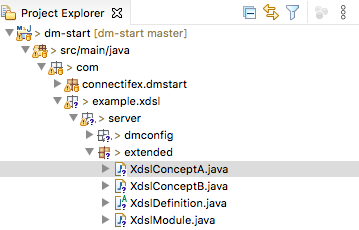

These are generated when you first create a new `ClassDefinition` for a DSL concept

You are free to add any other functions to implement the behavior of your DSL here.

You can also add additional sanity checking logic to the `initialize()` function:

```
    public void initialize(XdslModuleDefinitionsIF definitions) throws ResultException {
        if (!initialized){
            // Add any required initialization or validation checks
            // If you fail validation, throw a ResultException that includes a clear
            // error description and location - uncomment the following example:
//            ResultException ex = new ResultException("Error description");
//            ex.moreMessages("Additional error information");
//            ex.setLocationInfo(getFile(), getLineNumber());
//            throw(ex);
            initialized = true;
        }
    }
```

NOTE: the `definitions` argument passed here is a handle to the [Definition Manager](#3-4-3-the-definition-manager)
that allows you to access any other loaded concept. This gives a great deal of scope in terms of the type of sanity checking
you want to add.

Also, all DMOs associated with your DSL have additional meta information added to them when they are loaded.

If you call `toOIF()` on and instance of `XdslConceptA` you will see something similar to:

```
XdslConceptA
alternate             william "prefers this:" bill note="Shakespeare can be odd"
definedInXdslModule   example
dmoFromModule         example
dotName               example.concept1.XdslConceptA
file                  /Users/peterstrong/workspace-dmstart/dm-start/src/test/java/com/example/xdsl/tools/xdslutil/data/example.xdsl
intValue              99
lineNumber            4
name                  concept1
refToB                william
stringValue           just some string
```

The following meta attributes are added:

- definedInXdslModule
- dmoFromModule
- dotName
- file
- lineNumber

So, if you are sanity checking and find an error, it's easy to report the file and line where the problem occurred.


# 3.4 Run-time Aspects

The following sections cover aspects associated with some of the run-time infrastructure of a dark-matter DSL.

## 3.4.1 Modules

All specification of concept instances associated with your DSL will be contained in files that end with your
chosen DSL abbreviation, in this case `.xdsl`. These files are referred to as "modules" and have, as their first
object instance, a specification of an `XdslModule`.

The module definition for our example DSL resides with the rest of the dark-matter schema and appears as follows:

```
DSDefinitionModule
name                        XdslModule
fileExtension               xdsl
dmdID                       1
moduleClassName             XdslModule
moduleDependenceAttribute   dependsOnXdslModule
baseDefinition              XdslDefinition
definedInModuleAttribute    definedInXdslModule
refersToDefsFromDSD         ConcinnityModule
supportDynamicSchemaLoading true
description                 This is the module definition for the xdsl domain-specific language.
```

You can extend a `DSDefinitionModule` to have additional attributes, just like a `ClassDefinition` if there is other
information that you want your users to specify as part of a module.

Navigate to:

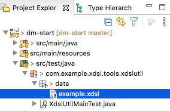

The `example.xdsl` file is a module:


The `name` of a module must match the name of the file in which it is defined.

Modules can depend on other modules. This is done by specifying one or more values for the `moduleDependenceAttribute`; 
in this case, you can see that that attribute is `dependsOnXdslModule`.

If we wanted `example.xdsl` to depend on module `otherDefinitions.xdsl` we would specify:

```
XdslModule
name                 example
dependsOnXdslModule otherDefinitions
```

In another tutorial, we'll cover the topic of loading definitions not just from other locations in the 
file system, but from other JARs as well.

## 3.4.1 The DSL Utility

As part of initial creation of a DSL, an initial utility is created that can form the basis for
your application. You can find it here:

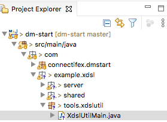

This merely provides an example of how to use the generated DSL.

In the `run(String[] args)` method, you'll see a very important piece of initialization code that will be required
whenever you use the dark-matter framework:

```
    SchemaManager       schema = new SchemaManager();
    XdslSchemaAG        sd     = new XdslSchemaAG();
    schema.manageSchema(sd);
```

This piece of code initializes the dark-matter schema mechanisms to recognize the objects associated with 
your DSL.

## 3.4.2 The Config Loader

The config loader allows for loading of modules into your application. For the example, it resides here:

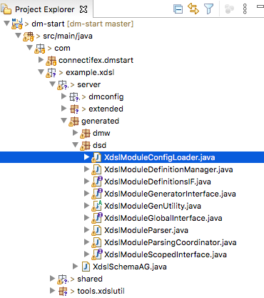

If you have modules in multiple directories (that don't share a common root) you can specify additional `-srcdirs` and
the config loader will find modules in those source directories. By default, it will search recursively for
`.xdsl` modules starting at each specified `srcdir`.

The config loader will also:

- instantiate objects for each DSL object and add them to the [Definition Manager](#3-4-3-the-definition-manager)
- perform basic type checking of the attributes specified for objects
- resolve reference attributes and report errors if referenced objects can't be found
- call the `initialize()` on all objects so that your manually specified business logic is executed
- provide you with a handle to the definition manager 


## 3.4.3 The Definition Manager

The generated definition manager (which resides in the same package as the config loader) provides access to all loaded DSL configuration objects. 

<!-- comment -->

# Appendix: Other Notes

## Maven Warnings

Within Eclipse, you may see a warning like:

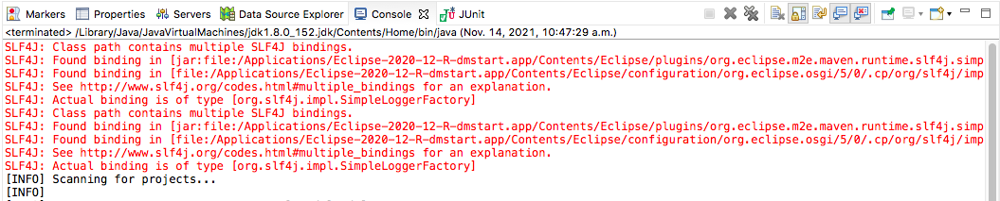

You may safely ignore these warnings - but if you want further information on them, see the following Stack Overflow question:
 [Eclipse Maven: SLF4J: Class path contains multiple SLF4J bindings](https://stackoverflow.com/questions/63518376/eclipse-maven-slf4j-class-path-contains-multiple-slf4j-bindings)

<!--stackedit_data:
eyJoaXN0b3J5IjpbNjEzNDQwMTg4LDYyNTQ5NzQwNywtNzUyMj
cwNjk1XX0=
-->